# Mars Mission Systems Engineering Question Map

This document captures the question hierarchy from `/Users/gmezo/aiscientist/hackatlon/aiscientist/mars_mission_questions.md`, preserves it in markdown form, and maps each branch to the systems-engineering tasks and radiation-shielding specifications maintained in this repository.

## Original Question Graph

```mermaid
graph TD
    %% ROOT
    0((0. How to create a spacecraft to Mars...)) --> 1("1. How to ensure the minimum mass of the spacecraft?")
    0 --> 2("2. How to ensure radiation protection for the crew?")
    0 --> 3("3. How to ensure the airtightness and safety of the structure?")
    0 --> 4("4. How to combine chemical and nuclear engines in one ship?")
    0 --> 5("5. How to ensure the reusability of the ship?")

    %% BRANCH 1
    1 --> 1.1("1.1 How should materials be used?")
    1.1 --> 1.1.1("1.1.1 What lightweight materials are suitable for the hull?")
    1.1.1 --> 1.1.1.1("1.1.1.1 What types of carbon fiber are suitable?")
    1.1.1.1 --> 1.1.1.1.1("1.1.1.1.1 What type of carbon fiber weave is needed?")
    1.1.1.1.1 --> 1.1.1.1.1.1("What is weaving in the context of composites?")
    1.1.1.1.1 --> 1.1.1.1.1.2("How does fiber direction affect the force vector?")
    1.1.1.1 --> 1.1.1.1.2("1.1.1.1.2 What elastic modulus of carbon fiber to choose?")
    1.1.1.1.2 --> 1.1.1.1.2.1("What is Young's modulus?")
    1.1.1.1.2 --> 1.1.1.1.2.2("What force in Newtons causes 1% elongation?")
    1.1.1.1 --> 1.1.1.1.3("1.1.1.1.3 What tensile strength of carbon fiber is necessary?")
    1.1.1.1.3 --> 1.1.1.1.3.1("At what load in Pascals does the molecular bond break?")

    1.1.1 --> 1.1.1.2("1.1.1.2 What glass fibers can be used?")
    1.1.1.2 --> 1.1.1.2.1("1.1.1.2.1 What is the minimum possible fiber diameter?")
    1.1.1.2 --> 1.1.1.2.2("1.1.1.2.2 What composite density is acceptable?")
    1.1.1.2 --> 1.1.1.2.3("1.1.1.2.3 What fiber orientation to choose?")

    1.1.1 --> 1.1.1.3("1.1.1.3 What nanocomposites are suitable?")
    1.1.1.3 --> 1.1.1.3.1("1.1.1.3.1 What nanoparticles to use?")
    1.1.1.3.1 --> 1.1.1.3.1.1("What is a nanoparticle by definition?")
    1.1.1.3.1 --> 1.1.1.3.1.2("What chemical element does the core consist of?")
    1.1.1.3 --> 1.1.1.3.2("1.1.1.3.2 What matrix for the nanocomposite to apply?")
    1.1.1.3 --> 1.1.1.3.3("1.1.1.3.3 How to ensure the homogeneity of the nanocomposite?")

    1.1 --> 1.1.2("1.1.2 Should hydrogen-containing materials be used?")
    1.1.2 --> 1.1.2.1("1.1.2.1 What polymers with high hydrogen content can be used?")
    1.1.2.1 --> 1.1.2.1.1("1.1.2.1.1 What type of polyethylene is suitable?")
    1.1.2.1 --> 1.1.2.1.2("1.1.2.1.2 What type of polyacrylate is suitable?")
    1.1.2.1 --> 1.1.2.1.3("1.1.2.1.3 What level of hydrogen in the material is necessary?")

    1 --> 1.2("1.2 How to reduce fuel mass?")
    1.2 --> 1.2.1("1.2.1 What engines to use?")
    1.2.1 --> 1.2.1.1("1.2.1.1 What chemical engine is needed?")
    1.2.1.1 --> 1.2.1.1.1("1.2.1.1.1 What type of fuel is needed for liftoff?")
    1.2.1.1 --> 1.2.1.1.2("1.2.1.1.2 What type of fuel is needed for landing?")
    1.2.1.1 --> 1.2.1.1.3("1.2.1.1.3 What nozzle expansion ratio is required?")
    1.2.1 --> 1.2.1.2("1.2.1.2 What nuclear thermal engine to use?")
    1.2.1.2 --> 1.2.1.2.1("1.2.1.2.1 What nuclear reactor to use?")
    1.2.1.2 --> 1.2.1.2.2("1.2.1.2.2 What propellant to use?")
    1.2.1.2 --> 1.2.1.2.3("1.2.1.2.3 What working medium temperature to maintain?")

    1.2 --> 1.2.2("1.2.2 How to reduce the amount of fuel required?")
    1.2.2 --> 1.2.2.1("1.2.2.1 Which route minimizes fuel consumption?")
    1.2.2.1 --> 1.2.2.1.1("1.2.2.1.1 Which launch window to choose?")
    1.2.2.1 --> 1.2.2.1.2("1.2.2.1.2 Which flight is minimal in time?")
    1.2.2.1 --> 1.2.2.1.3("1.2.2.1.3 Which flight is minimal in Δv?")

    1.2 --> 1.2.3("1.2.3 Where to get fuel for the return?")
    1.2.3 --> 1.2.3.1("1.2.3.1 How to produce fuel on Mars?")
    1.2.3.1 --> 1.2.3.1.1("1.2.3.1.1 How to extract CO2?")
    1.2.3.1 --> 1.2.3.1.2("1.2.3.1.2 How to extract water from the soil?")
    1.2.3.1.2 --> 1.2.3.1.2.1("Boiling point of water at Martian pressure?")
    1.2.3.1.2 --> 1.2.3.1.2.2("Bond energy of a water molecule with regolith?")
    1.2.3.1 --> 1.2.3.1.3("1.2.3.1.3 How to produce methane?")
    1.2.3 --> 1.2.3.2("1.2.3.2 How to store the produced fuel?")
    1.2.3.2 --> 1.2.3.2.1("1.2.3.2.1 What storage temperature is needed?")
    1.2.3.2 --> 1.2.3.2.2("1.2.3.2.2 What type of tanks is needed?")
    1.2.3.2 --> 1.2.3.2.3("1.2.3.2.3 How to prevent leakage?")

    1 --> 1.3("1.3 How to ensure stability and landing?")
    1.3 --> 1.3.1("1.3.1 How to ensure a low center of gravity?")
    1.3.1 --> 1.3.1.1("1.3.1.1 Where should the tanks be located?")
    1.3.1.1 --> 1.3.1.1.1("1.3.1.1.1 What tank volume is optimal?")
    1.3.1.1 --> 1.3.1.1.2("1.3.1.1.2 What shape should the tank be?")
    1.3.1.1 --> 1.3.1.1.3("1.3.1.1.3 Where should the tank be attached?")
    1.3.1 --> 1.3.1.2("1.3.1.2 Where to place the engines?")
    1.3.1 --> 1.3.1.3("1.3.1.3 How to place the cargo?")
    1.3 --> 1.3.2("1.3.2 How to ensure stable vertical landing?")
    1.3.2 --> 1.3.2.1("1.3.2.1 What supports to use?")
    1.3.2.1 --> 1.3.2.1.1("1.3.2.1.1 What length should the supports be?")
    1.3.2.1 --> 1.3.2.1.2("1.3.2.1.2 What support thickness to choose?")
    1.3.2.1 --> 1.3.2.1.3("1.3.2.1.3 What support spread angle is optimal?")
    1.3.2
    %% Remaining branches omitted for brevity (structure, propulsion, reusability) – refer to source file.
```

> *Note: The original graph extends further; for clarity only the relevant radiation-related branch (2) is analyzed in detail below. The full hierarchy is preserved in the mermaid diagram above.*

## System-Engineering Mapping

| Question Path | Primary Discipline | Coverage in Repository | Notes |
| --- | --- | --- | --- |
| 2 → “How to ensure radiation protection for the crew?” | Radiation Shielding | [`SYSTEM_SPEC.md`](../radiation-shielding/SYSTEM_SPEC.md) and linked sub-specs | Directly aligned; see sections on requirements, architecture, design, and ops. |
| 2 → 2.1 “Which shielding materials?” (implicit in branch 2) | Materials & Structures | [`system-spec/DESIGN_APPROACH.md`](../radiation-shielding/system-spec/DESIGN_APPROACH.md) | Hydrogen-rich materials, water walls, regolith integration. |
| 2 → 2.x “Storm shelter / SPE response” | Mission Operations | [`system-spec/OPERATIONS_SUSTAINMENT.md`](../radiation-shielding/system-spec/OPERATIONS_SUSTAINMENT.md) | Storm shelter protocols and consumable positioning. |
| 2 → (dosimetry implied) | Instrumentation & Monitoring | [`system-spec/ANALYSIS_MODELING.md`](../radiation-shielding/system-spec/ANALYSIS_MODELING.md) and [`specs/dosimetry/README.md`](../dosimetry/README.md) | Dosimetry architecture and data analysis. |
| 2 → Risk considerations | Risk Management | [`system-spec/RISK_MANAGEMENT.md`](../radiation-shielding/system-spec/RISK_MANAGEMENT.md) | SPE exceedance, dosimetry failure mitigation. |
| 1.* (mass minimization) | Vehicle Mass Properties | **Out of scope** (mass focused) | Could link to future structural mass optimization doc. |
| 3.* (airtightness/safety) | Structures, MMOD, Safety | Not currently covered; potential future work. |
| 4.* (engine integration) | Propulsion Systems | Not covered; inform propulsion team. |
| 5.* (reusability) | Sustainment & Maintenance | Partially addressed in [`system-spec/OPERATIONS_SUSTAINMENT.md`](../radiation-shielding/system-spec/OPERATIONS_SUSTAINMENT.md) regarding maintenance; broader reuse requires additional docs. |

## Recommended Systems Engineering Tasks

1. **Radiation Protection Tasking**
   - Owners: Radiation Protection IPT / Systems Engineering.
   - Reference: Entire radiation shielding spec suite.
   - Actions: Finalize dose budgets, storm shelter design, surface regolith plan, dosimetry deployment.

2. **Materials & Structural Mass Optimization**
   - Owners: Structures IPT.
   - Current Coverage: Limited—needs dedicated structural mass spec (to answer Branch 1 questions).
   - Recommendation: Spin up new spec building on composite/nanocomposite trade studies.

3. **Pressurized Structure Integrity & MMOD Protection**
   - Owners: Structures & Safety IPTs.
   - Gap: Develop airtightness and micrometeoroid shielding documentation aligning with Branch 3.

4. **Propulsion Integration**
   - Owners: Propulsion IPT.
   - Task: Separate chemical/nuclear engine operations, shielding between reactor and crew (Branch 4).

5. **Reusability and Maintenance Planning**
   - Owners: Operations & Sustainment IPT.
   - Current Coverage: Partially in operations spec; extend to address detailed maintenance cycles (Branch 5).

## Next Steps

- **For Radiation Branch (2):** Continue refining the existing shielding specs and link question-driven requirements into the requirement management tool (e.g., DOORS).
- **For Other Branches:** Use this question map as a backlog to prioritize additional system specifications so that each major question path has a documented owner and plan.

---

*Maintained as part of the systems engineering knowledge base for the WE_GO_MARS project.*
